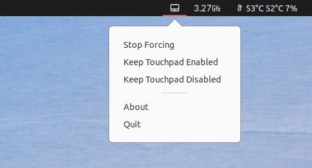

# Read Before Installing

It may be possible to find touchpad toggle button with **`xmodmap -pk`**. I have listed touchpad related keymaps with **`xmodmap -pk | grep Touch`** and the output is below:

```
    199     0x1008ffa9 (XF86TouchpadToggle) 0x0000 (NoSymbol)   0x1008ffa9 (XF86TouchpadToggle) 0x0000 (NoSymbol)   0x1008ffa9 (XF86TouchpadToggle) 
    200     0x1008ffb0 (XF86TouchpadOn) 0x0000 (NoSymbol)   0x1008ffb0 (XF86TouchpadOn) 0x0000 (NoSymbol)   0x1008ffb0 (XF86TouchpadOn) 
    201     0x1008ffb1 (XF86TouchpadOff)    0x0000 (NoSymbol)   0x1008ffb1 (XF86TouchpadOff)    0x0000 (NoSymbol)   0x1008ffb1 (XF86TouchpadOff)
```

I have just disabled the `XF86TouchpadToggle` with the keycode 199 via:

```bash
xmodmap -e 'keycode 199='
```

This disables touchpad toggle on my laptop, but the names may be different for your laptop model.

**NOTE:** I may rename this repository and change it to use it for accessing hidden keymaps.


# prevent_touchpad_toggle



Sets touch-pad on/off state repetitively in small intervals. Can be used in systems where touch-pad toggles itself or being toggled by accident.

- Tested on Ubuntu 20.04

- This app remembers the last toggle state between reboots. (Can be modified in `.py` file)
- Toggles touchpad on/off state every `0.25` seconds.

## Install

```bash
# Install dependencies
pip install PyQt5 python-is-python3

# Install the app
bash install.sh
```

- You can run `python3 $HOME/.local/share/prevent_touchpad_toggle_app/prevent_touchpad_toggle_app.py` or restart the computer. App will start in the system tray.


## Disable App on Boot

 Run:

```bash
gnome-session-properties
```

Disable `prevent_touchpad_toggle_app`
